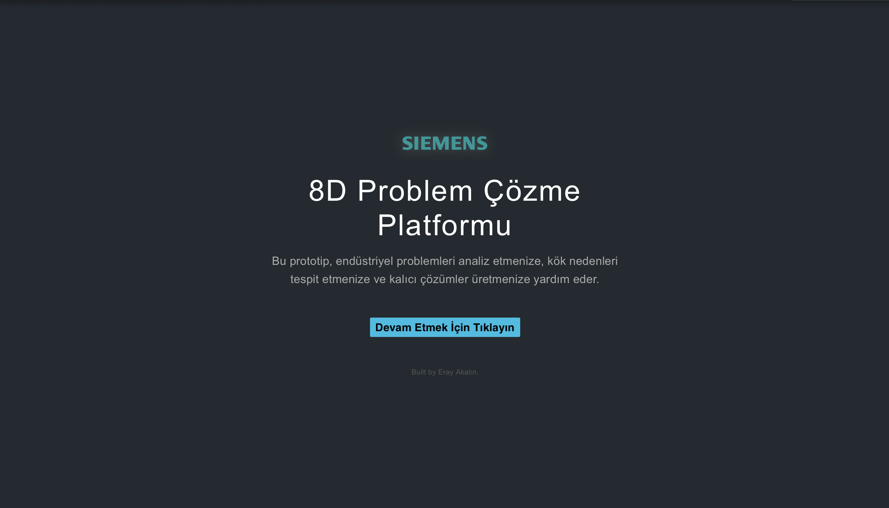
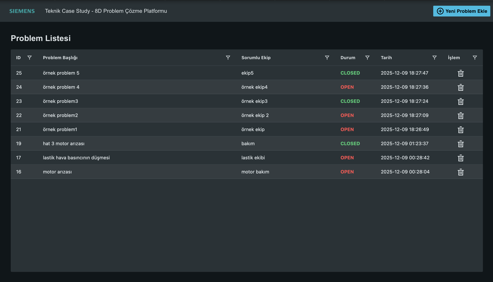

# 8D Problem Solving Platform (MVP)

This project is a Full-Stack prototype developed within the scope of the **Siemens Technical Case Study** to digitize the "8D Problem Solving Methodology" for tracking and analyzing production line and quality management issues.

The project specifically focuses on the digitization and visualization of problem definition (**D1-D2**) and root cause analysis (**D4-D5**) processes using **recursive** data structures.

---

##  Live Demo

You can test the live application via the link below:
 **[View Live Application](https://eray-8d-platform.page.gd)**

---

##  Screenshots

| Landing Page | Dashboard & List | Root Cause Tree |
|:---:|:---:|:---:|
|  |  |  |

---

##  Tech Stack

### Frontend
* **Framework:** React (Vite)
* **UI Library:** **Siemens iX Design System** (@siemens/ix-react)
* **Grid System:** Ag-Grid (Integrated with Siemens iX Theme)
* **HTTP Client:** Axios

### Backend
* **Language:** Native PHP
* **Database:** MySQL
* **Architecture:** RESTful API, Service-Repository-Controller Pattern
* **Data Structure:** Adjacency List Model (Parent-Child Relationship)

---

##  Key Features

### 1. Dashboard (Problem Management)
* Listing of all problems using the **Ag-Grid** infrastructure.
* Creation of **New Problems (D1-D2)** using the Siemens iX Modal component.
* Instant toggling of problem status (Open/Solved).
* Responsive Design and **Application Header** structure.

### 2. Dynamic Root Cause Tree (Root Cause Analysis)
* **Recursive Component Structure:** "Why?" questions can be added under a problem with unlimited depth.
* **Visualization:** The hierarchical structure in the database is rendered on the frontend as a nested tree connected by visual lines.
* **CRUD Operations:** Every node on the tree can be deleted or have new child nodes added to it.

### 3. Action Determination (Permanent Corrective Action)
* Any cause can be flagged as a "Root Cause".
* A permanent solution can be entered for the item marked as the root cause.
* Visually highlighted with green cards and icons.

---

##  Installation & Setup (Local)

Follow the steps below to run the project on your local machine.

### 1. Database Setup
1.  Create a database named `eightd_db` on your MySQL server.
2.  Import the `database.sql` file located in the root directory into this database.

### 2. Backend Configuration
1.  Rename the `backend/config-example.php` file to `backend/config.php`.
2.  Open the file and enter your own database credentials:
    ```php
    return [
        'db' => [
            'host' => 'your host',
            'port' => 0000,
            'dbname' => 'your db name', 
            'user' => 'your username',      
            'pass' => 'your password',          
            'charset' => 'utf8mb4',
        ],
        'auth' => [
            'username' => 'admin',
            'password' => 'YOUR_ADMIN_PASSWORD'
        ],
    ];
    ```
3.  Start your PHP server pointing to the `backend/public` directory.

### 3. Frontend Setup
1.  Navigate to the `frontend` directory in your terminal:
    ```bash
    cd frontend
    ```
2.  Install dependencies and start the project:
    ```bash
    npm install
    npm run dev
    ```

---

##  Technical Approach & Decisions

* **Data Modeling:** The **Adjacency List Model** (`parent_id` column) was used in the database for the tree structure. A recursive PHP function transforms this flat data into a nested JSON format to be served to the Frontend.
* **Security:** Database configurations are kept out of the repository using `.gitignore` (a `config.example.php` template is provided).
* **UI/UX:** The Siemens iX design system was applied throughout the application. User experience was enhanced with Landing Page animations.

---

Developer: Musa Eray Akalın
